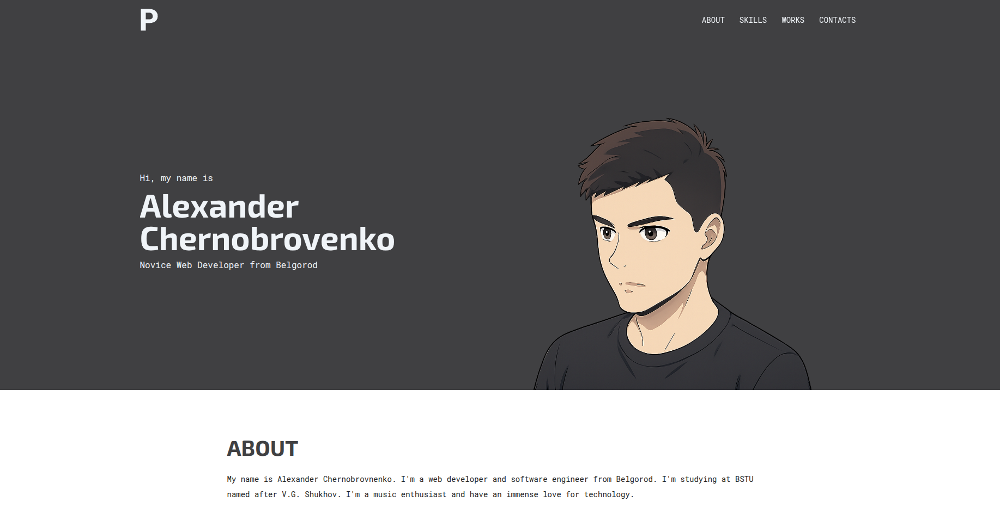

# Portfolio [](https://github.com/IIyCbKA/portfolio/blob/main/LICENSE) [](https://github.com/microsoft/TypeScript)

## 📝 Description

This is a portfolio website of web developer IIyCbKA. Site is designed in a classic, strict style, without annoying excessive animations. Currently, there are sections:

- About
- Skills
- Works
- Contacts

## 🚀 Demo


[View Demo](https://iiycbka.github.io/portfolio/)

## 🛠 Languages and tools


## 💻 Installation and Launch

```bash
git clone https://github.com/IIyCbKA/portfolio
cd portfolio
npm install
npm run dev
```

## 🤝 Contribution

I would appreciate any suggestions for improving website. I will consider all Pull Requests.

## 📄 Licence

Portfolio is [MIT licensed](https://github.com/IIyCbKA/portfolio/blob/main/LICENSE).

## 🙏 Gratitude

- Thanks to Chase Ohlson for inspiration:
  [Github](https://github.com/brohlson),
  [Repository](https://github.com/brohlson/chaseohlson)
- [Device Models](https://www.figma.com/community/plugin/906973799344127422/device-models) from [@codyb](https://www.figma.com/@codyb) ([Licensed under Community Free](https://www.figma.com/legal/community-free-resource-license))
- [Figmoji](https://www.figma.com/community/plugin/736612173445813953/figmoji) from [@nitin](https://www.figma.com/@nitin) ([Licensed under Community Free](https://www.figma.com/legal/community-free-resource-license))
- All resources and libraries that I used in this project.
